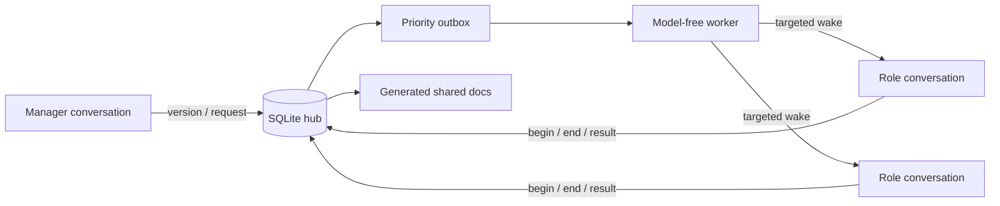

# Codex Task Dispatch Hub

An unofficial, local, model-free dispatcher for coordinating a small team of
persistent Codex conversations.

The hub binds roles to real `CODEX_THREAD_ID` values, stores collaboration state
in SQLite, routes actionable requests to the intended existing conversation,
and preserves role continuity across context compaction. Its background worker
does not call a model to decide where work goes. Waking a recipient starts a
normal Codex turn and therefore uses that recipient's configured Codex account
and model.

> This project is not affiliated with or endorsed by OpenAI. The desktop-owner
> adapter relies on an experimental local interface and may require updates when
> the Codex desktop app changes.

## Why it exists

Persistent conversations are useful as stable owners of different product
surfaces, but direct cross-thread chatter creates duplicated context, unclear
completion semantics, and accidental role drift. This hub makes coordination
explicit:

- `begin` and `end` delimit one conversation's formal work turn;
- `wait` requests wake the sender only when all declared dependencies resolve;
- `notify` requests require action without creating a completion wake for the
  sender;
- identity comes from `CODEX_THREAD_ID`, not a title or self-declared role;
- shared documents keep only the current body plus revision notes;
- product updates and request history are rendered from the SQLite ledger;
- a version becomes ready for review only after required participants submit and
  required requests close.



## Requirements

- Python 3.9 or later; no third-party Python packages.
- Codex Desktop with native thread tools available in the current conversation.
- Existing Codex conversations whose thread IDs you control.
- Node.js only for the mocked JavaScript tests.

The default entry is `native_call.js`, evaluated in the current conversation's
`functions.exec` tool context. It does not launch a separate app-server or model.
The optional worker only delivers to conversations already owned by Desktop.
Unknown ownership or unavailable native tools leaves work queued, without a
hidden fallback. Desktop tool and IPC compatibility depends on the installed app.

## Quick start

1. Clone the repository.

   ```sh
   git clone git@github.com:LOSTTEMPER/codex-task-dispatch-hub.git
   cd codex-task-dispatch-hub
   ```

2. Create a private team file. It is ignored by Git.

   ```sh
   cp examples/team.example.json config/team.json
   ```

   Replace every example thread ID and adjust the generic role labels and scope.
   Do not commit `config/team.json`.

3. From the configured manager conversation, initialize the hub once.

   ```sh
   python3 bootstrap.py --config config/team.json
   ```

   Bootstrap refuses to run unless the current `CODEX_THREAD_ID` matches the
   configured manager. It also refuses to overwrite an initialized registry.

4. Optionally start the desktop-owned queue worker from an authorized terminal.

   ```sh
   python3 control.py start
   python3 control.py status
   ```

5. Add the collaboration rules from
   [`examples/AGENTS.collaboration.md`](examples/AGENTS.collaboration.md) to the
   shared project instructions.

6. To opt into identity-preserving compaction, copy
   [`examples/project-config.toml`](examples/project-config.toml) to the target
   project's `.codex/config.toml` and adjust the relative prompt path if the hub
   lives elsewhere.

   `experimental_compact_prompt_file` is an experimental Codex setting. Project
   configuration loads only for trusted projects. See the official
   [Codex configuration reference](https://developers.openai.com/codex/config-reference)
   and [advanced configuration guide](https://developers.openai.com/codex/config-advanced).

## Turn protocol

In `functions.exec`, load the bridge and pass the absolute ledger entry path:

```javascript
const root = "/absolute/path/to/codex-task-dispatch-hub";
const quote = value => "'" + value.replace(/'/g, "'\\''") + "'";
const source = await tools.exec_command({
  cmd: "cat " + quote(root + "/native_call.js"), max_output_tokens: 10000
});
if (source.exit_code !== 0) throw new Error("Cannot read hub entry");
const hub = new Function("tools", "operation", "payload", "hubPath", source.output);
text(await hub(tools, "begin", {request_ids: []}, root + "/hub.py"));
```

Use the same function for `identity`, `request`, `document_put`, and `end`.
The fourth parameter selects this checkout; omitting it uses `./hub.py` relative
to the tool's working directory. Save `result.run_id` from `begin`, then end with:

```javascript
text(await hub(tools, "end", {
  run_id: "actual-run-id", state: "idle", summary: "Result and limitations",
  results: [], product_updates: []
}, root + "/hub.py"));
```

The bridge persists first, claims an existing outbox record, sends its exact
registered message with native tools, and records the receipt. Read-only ledger
operations do not drain. CLI `python3 hub.py call <operation> --json '{}'` is
available for diagnostics; after an emergency CLI write use the native `drain`
operation in the current tools context. Do not manually relay or duplicate tasks.

End states are `idle`, `waiting`, `submitted`, `needs_user`, and `interrupted`.
`waiting` requires `wait_for` dependencies or an explicit `budget_review_id`.
Register a dependency set once and end the turn; do not poll or send receipt
requests. `end` completes a work turn, not its requests: submit each actual result
in `results`. Pure progress belongs in `document_put` or `product_updates`.

## Requests

Create requests only after `begin`:

```json
{
  "idempotency_key": "unique-action-key",
  "to": "backend",
  "kind": "wait",
  "urgent": false,
  "important": true,
  "blocking": "partial",
  "reason": "The caller needs the service contract before integration.",
  "title": "Confirm the response contract",
  "action": "Publish the final response fields and error behavior.",
  "acceptance": "A versioned document is available and referenced in the result.",
  "refs": [],
  "required_for_review": true
}
```

Priority is deterministic:

1. urgent and important;
2. important only;
3. urgent only;
4. neither.

The initiating conversation supplies urgency, importance, blocking impact, and
the reason. The hub sorts and delivers; it does not use an LLM to reinterpret
them.

## Shared documents and versions

`document_put` uses optimistic revisions and owner-based write control. The
current document body is retained; revision notes remain in history. Generated
files under `docs/` are projections of the database and should not be edited by
hand or committed with private operational data.

The manager uses `version_create` to establish a goal and initial assignments.
When every required participant is `submitted` and every required request is
closed, readiness is merged into an existing dependency result where possible.
Obsolete pending notices are archived without resending. Only the manager can
accept or archive the version. Cycle notices use actual registered wait edges,
not unrelated requests; unchanged cycles are reported once.

## Operations

```sh
python3 control.py status
python3 control.py stop
python3 control.py start
```

The worker lock prevents duplicate workers. A delivery left in `sending` during
a crash becomes `uncertain`; it is never blindly retried. The manager can retry
only after checking the target conversation and ledger.

The bridge and worker do not approve tools, change permissions, choose models,
or fabricate user answers. Native sends still require the user's authorization.

### Completed native delivery reconciliation

If a confirmed `desktop-native` delivery remains `delivered` after its turn has
finished, the manager can call `delivery_reconcile_native` via the native bridge
with `delivery_id`, `expected_thread_id`, and `expected_turn_id`. The bridge reads
fresh native status, bounded history (at most 15 turns), then status again. All
intervening turns must be completed, the target idle, and the ledger have no active
run. A manager-bound 60-second ticket and transactional ledger signature protect
against stale evidence. Only the outbox completion changes; business request
status, message, attempts and original errors are preserved. The bridge then
drains only that recipient's next registered delivery.

Uncertain, missing-turn, desktop-owner and other-version records are rejected.
Private incident-specific recovery exceptions are deliberately not distributed.
Do not call the internal prepare/commit operations or supply invented evidence.
These checks are a same-user workflow convention, not a security boundary.

### Soft token budgets

Budgets are optional and disabled until configured by the manager. They count
actual input/cached-input/output usage for assigned turns and discovered child
threads, not money or account limits. `budget_configure` enables the policy;
`request` can attach `budget:{token_limit,warning_tokens}` or an existing
`budget_id`. Existing unassigned work is not retroactively charged. Administrative
exceptions require `unmanaged_reason` when enforcement is enabled.

Use `budget_estimate` before work, `budget_view`/`budget_list` to inspect coverage,
`budget_ack` for notices, and `budget_report` followed by
`end {state:"waiting",budget_review_id:...}` for review. The manager uses
`budget_review_get` and `budget_decide` (increase/replan/phase/stop/clarify).
Only an explicit positive increase adds allowance; counters never reset.
`budget_close` requires completed work and descendants. Budget review is separate
from business dependency cycles. It does not cancel tools or impose native goal
limits. Missing sources are marked incomplete, never interpreted as zero usage.

The optional worker reads local Codex token metadata and rollout usage counters
for registered threads and descendants. It stores accounting metadata, not
conversation contents or credentials. The current collector expects the local
`state_5.sqlite` schema and reports incomplete coverage on incompatible versions.
No network/model API is used by the collector. Live budget notices use the
experimental Desktop owner tool-output channel; an unknown outcome is not retried.

## Local data and privacy

Runtime data is stored under `.state/` and generated collaboration views under
`docs/`. Both are ignored by Git. The private team binding file is
`config/team.json`, also ignored.

These files can contain thread IDs, identity cards, request text, document
bodies, and delivery metadata. Back them up and protect them as you would local
conversation data. Never attach them to public bug reports without replacing
all identifiers and content with synthetic values.

The repository intentionally contains no real thread IDs, conversation text,
personal identity cards, user-specific paths, production logs, or live team
records.

## Known limitations

- macOS is the primary tested environment.
- Desktop-owner coordination uses an experimental same-user interface.
- The compaction override is experimental and can change with Codex releases.
- This is a same-user coordination mechanism, not a security boundary against
  malicious local processes.
- A running worker is not proof that a business task succeeded; recipients must
  submit explicit results through `end`.

## Tests

```sh
PYTHONDONTWRITEBYTECODE=1 python3 -m unittest discover -s tests -v
node tests/native_call_test.cjs
node --test tests/native-reconcile.test.mjs
```

The test suite covers identity isolation, idempotency, priority, grouped waits,
notify behavior, dependency cancellation and cycles, document ownership,
version review, product-update deduplication, restart uncertainty, and live
desktop busy-state handling.

## Update provenance

Version 0.2.0 synchronizes the locally deployed October 2026 shared ledger,
native bridge, worker, budget collector, and dependency-cycle/native-completion
repairs. Public bootstrap remains configuration-based. Each independent team
uses its own checkout/root, private config, `.state/`, and generated `docs/`.
No running deployment, database, team binding, or worker is migrated by this
source update. Stop a worker and back up its private state before upgrading that
deployment; never copy another team's state. Existing 1.0 identity cards can be
upgraded by the manager using `identity_protocol_update`.

## License

MIT. See [LICENSE](LICENSE).
