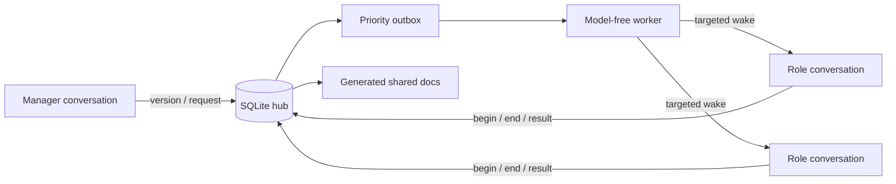

# Codex Task Dispatch Hub

An unofficial, local, model-free dispatcher for coordinating a small team of
persistent Codex conversations.

The hub binds roles to real `CODEX_THREAD_ID` values, stores collaboration state
in SQLite, routes actionable requests to the intended existing conversation,
and preserves role continuity across context compaction. Its background worker
does not call a model to decide where work goes. Waking a recipient starts a
normal Codex turn and therefore uses that recipient's configured Codex account
and model.

> This project is not affiliated with or endorsed by OpenAI. The desktop-owner
> adapter relies on an experimental local interface and may require updates when
> the Codex desktop app changes.

## Why it exists

Persistent conversations are useful as stable owners of different product
surfaces, but direct cross-thread chatter creates duplicated context, unclear
completion semantics, and accidental role drift. This hub makes coordination
explicit:

- `begin` and `end` delimit one conversation's formal work turn;
- `wait` requests wake the sender only when all declared dependencies resolve;
- `notify` requests require action without creating a completion wake for the
  sender;
- identity comes from `CODEX_THREAD_ID`, not a title or self-declared role;
- shared documents keep only the current body plus revision notes;
- product updates and request history are rendered from the SQLite ledger;
- a version becomes ready for review only after required participants submit and
  required requests close.



## Requirements

- Python 3.9 or later; no third-party Python packages are required.
- Codex CLI or the macOS Codex desktop application's bundled `codex` binary.
- Existing Codex conversations whose thread IDs you control.
- A trusted local project when using project-level `.codex/config.toml`.

The worker looks for `codex` on `PATH`, then checks the standard macOS desktop
bundle. Set `CODEX_DISPATCH_CODEX_BIN` to an explicit executable path when
needed. Set `CODEX_DISPATCH_WORKSPACE` to choose the app-server working
directory.

## Quick start

1. Clone the repository.

   ```sh
   git clone git@github.com:LOSTTEMPER/codex-task-dispatch-hub.git
   cd codex-task-dispatch-hub
   ```

2. Create a private team file. It is ignored by Git.

   ```sh
   cp examples/team.example.json config/team.json
   ```

   Replace every example thread ID and adjust the generic role labels and scope.
   Do not commit `config/team.json`.

3. From the configured manager conversation, initialize the hub once.

   ```sh
   python3 bootstrap.py --config config/team.json
   ```

   Bootstrap refuses to run unless the current `CODEX_THREAD_ID` matches the
   configured manager. It also refuses to overwrite an initialized registry.

4. Start the worker from an authorized local Codex terminal.

   ```sh
   python3 control.py start
   python3 control.py status
   ```

5. Add the collaboration rules from
   [`examples/AGENTS.collaboration.md`](examples/AGENTS.collaboration.md) to the
   shared project instructions.

6. To opt into identity-preserving compaction, copy
   [`examples/project-config.toml`](examples/project-config.toml) to the target
   project's `.codex/config.toml` and adjust the relative prompt path if the hub
   lives elsewhere.

   `experimental_compact_prompt_file` is an experimental Codex setting. Project
   configuration loads only for trusted projects. See the official
   [Codex configuration reference](https://developers.openai.com/codex/config-reference)
   and [advanced configuration guide](https://developers.openai.com/codex/config-advanced).

## Turn protocol

Hub calls use JSON from standard input. Short payloads can use `--json`.

```sh
python3 hub.py call identity --json '{}'
python3 hub.py call begin --json '{"request_ids":[]}'
```

Save the `run_id` returned by `begin`. Finish before the conversation sends its
final response:

```sh
python3 hub.py call end <<'JSON'
{
  "run_id": "run-id-from-begin",
  "state": "idle",
  "summary": "Optional team-visible result",
  "results": [],
  "product_updates": []
}
JSON
```

End states are `idle`, `waiting`, `submitted`, `needs_user`, and `interrupted`.
Use `waiting` only with `wait_for` request IDs. `end` closes a work turn; it does
not implicitly complete received requests.

## Requests

Create requests only after `begin`:

```json
{
  "idempotency_key": "unique-action-key",
  "to": "backend",
  "kind": "wait",
  "urgent": false,
  "important": true,
  "blocking": "partial",
  "reason": "The caller needs the service contract before integration.",
  "title": "Confirm the response contract",
  "action": "Publish the final response fields and error behavior.",
  "acceptance": "A versioned document is available and referenced in the result.",
  "refs": [],
  "required_for_review": true
}
```

Priority is deterministic:

1. urgent and important;
2. important only;
3. urgent only;
4. neither.

The initiating conversation supplies urgency, importance, blocking impact, and
the reason. The hub sorts and delivers; it does not use an LLM to reinterpret
them.

## Shared documents and versions

`document_put` uses optimistic revisions and owner-based write control. The
current document body is retained; revision notes remain in history. Generated
files under `docs/` are projections of the database and should not be edited by
hand or committed with private operational data.

The manager uses `version_create` to establish a goal and initial assignments.
When every required participant is `submitted` and every required request is
closed, the manager receives one review-ready event. Only the manager can accept
or archive the version.

## Operations

```sh
python3 control.py status
python3 control.py stop
python3 control.py start
```

The worker lock prevents duplicate workers. A delivery left in `sending` during
a crash becomes `uncertain`; it is never blindly retried. The manager can retry
only after checking the target conversation and ledger.

The app-server adapter declines command and file-change approval requests. It
does not fabricate user answers or grant permissions. A recipient that needs
authority should end with `needs_user` and ask the user in its own conversation.

## Local data and privacy

Runtime data is stored under `.state/` and generated collaboration views under
`docs/`. Both are ignored by Git. The private team binding file is
`config/team.json`, also ignored.

These files can contain thread IDs, identity cards, request text, document
bodies, and delivery metadata. Back them up and protect them as you would local
conversation data. Never attach them to public bug reports without replacing
all identifiers and content with synthetic values.

The repository intentionally contains no real thread IDs, conversation text,
personal identity cards, user-specific paths, production logs, or live team
records.

## Known limitations

- macOS is the primary tested environment.
- Desktop-owner coordination uses an experimental same-user interface.
- The compaction override is experimental and can change with Codex releases.
- This is a same-user coordination mechanism, not a security boundary against
  malicious local processes.
- A running worker is not proof that a business task succeeded; recipients must
  submit explicit results through `end`.

## Tests

```sh
PYTHONDONTWRITEBYTECODE=1 python3 -m unittest discover -s tests -v
```

The test suite covers identity isolation, idempotency, priority, grouped waits,
notify behavior, dependency cancellation and cycles, document ownership,
version review, product-update deduplication, restart uncertainty, and live
desktop busy-state handling.

## License

MIT. See [LICENSE](LICENSE).
